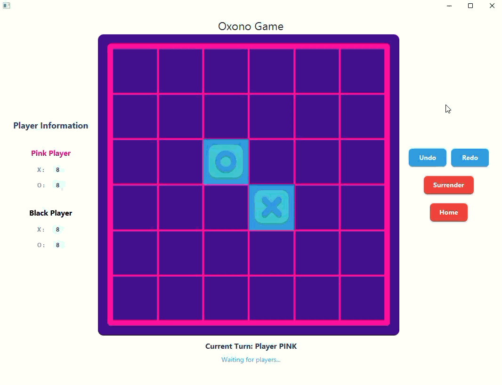
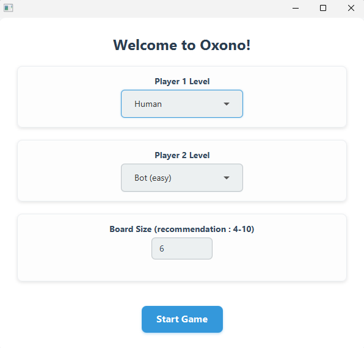
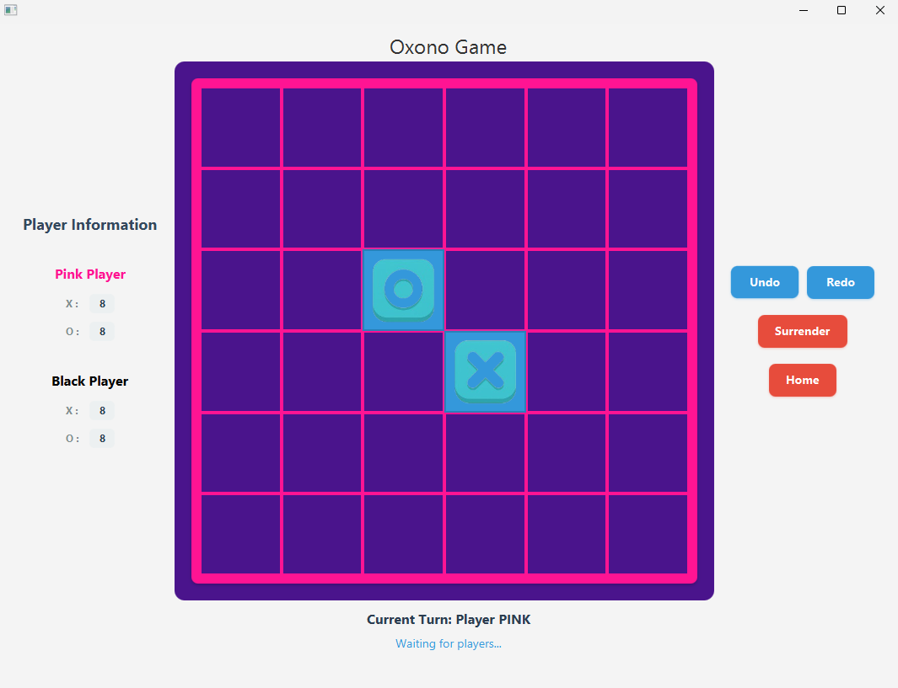
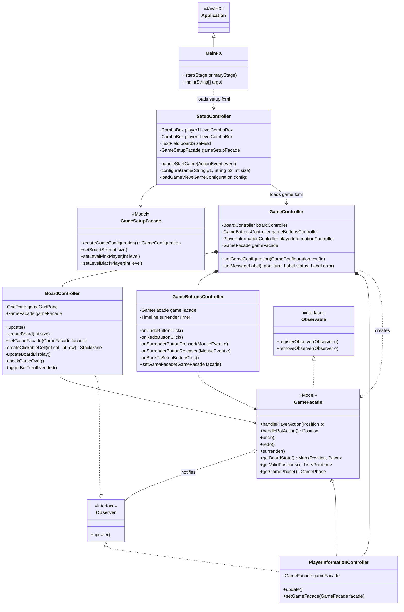

# OXONO

A Java implementation of the two-player board game **Oxono**, with a JavaFX graphical interface, a console mode, and bots of two difficulty levels.

Academic project developed at HE2B-ESI (Brussels).



## Table of contents

- [Features](#features)
- [Screenshots](#screenshots)
- [Game rules](#game-rules)
- [Architecture](#architecture)
- [Getting started](#getting-started)
- [Tests](#tests)
- [Disclaimer](#disclaimer)
- [License](#license)
- [Author](#author)

## Features

- Two game modes: **JavaFX GUI** and **console**
- Human vs Human, Human vs Bot, Bot vs Bot
- Two bot levels: easy (random moves) and medium (detects winning moves)
- **Undo / Redo**
- Configurable board size (4 to 10)
- Surrender by holding a button for 5 seconds (prevents accidental clicks)
- Highlighting of valid cells
- Non-blocking bot turns (the interface stays responsive while the bot "thinks")

## Screenshots

| Setup screen | Game in progress |
|---|---|
|  |  |

## Game rules

Two players (pink and black) share a square board with two totems, one marked X and one marked O. On each turn, a player moves one of the totems in a straight line, then places one of their tokens with the same symbol next to it. The first player to align four pieces of the same color or of the same symbol wins.

## Architecture

The project follows an **MVC** architecture. The model knows nothing about the views: views are refreshed through notifications (Observer pattern). The diagram below shows the JavaFX layer and its link with the model.



### Design patterns used

- **Observer**: `GameFacade` notifies `BoardController` and `PlayerInformationController` on every change.
- **Command**: each action (place a token, move a totem, choose a totem) is a command, which makes undo/redo possible.
- **Strategy**: bot behaviours (`RandomStrategy`, `WiningMoveStrategy`) are interchangeable.
- **Facade**: `GameFacade` and `GameSetupFacade` expose a simple API to the controllers.

### Project structure

```
src/main/java/be/esi/dev/oxono/
├── command/       Command interface and command manager (undo/redo)
├── controller/    fxml/ (JavaFX controllers) and console/
├── main/          MainFX and MainConsole entry points
├── model/         Game logic (board, players, pawns, commands, facade)
├── observer/      Observer / Observable interfaces
├── setup/         Game configuration
├── strategy/      Bot strategies
├── util/          Enums (Color, Symbol, GamePhase)
└── view/          Console view

src/main/resources/
├── view/          FXML files
└── images/        Pawn images
```

## Getting started

### Requirements

- JDK 23 or higher
- Maven 3.9+

### Run the graphical version
```
git clone https://github.com/ian-grande-dev/esi-oxono-javafx.git
cd esi-oxono-javafx
mvn javafx:run
```
Alternatively, open the project in IntelliJ IDEA and run `be.esi.dev.oxono.main.MainFX`.

### Run the console version

```
mvn compile
java -cp target/classes be.esi.dev.oxono.main.MainConsole
```
Alternatively, run `be.esi.dev.oxono.main.MainConsole` from your IDE.

## Tests

Unit tests are located in `src/test` (board logic, commands and surrender, observer).
```
mvn test
```
## Disclaimer

This is an educational project developed at HE2B-ESI. It is not affiliated with, or endorsed by, the creators or publisher of the board game Oxono. The game concept and its rules belong to their respective owners.

## License

Released under the MIT License. See the [LICENSE](LICENSE) file.

## Author

**Ian** - Student in Application Development at HE2B-ESI, Brussels

[LinkedIn](https://www.linkedin.com/in/ian-grande/) · [GitHub](https://github.com/ian-grande-dev) · [Email](mailto:ian.grande.pro@gmail.com)