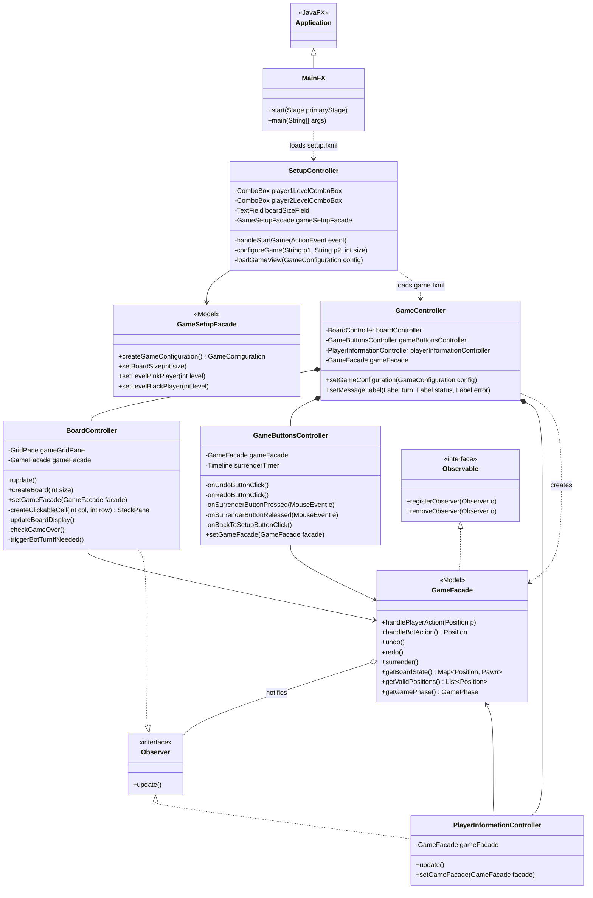

## Class diagram – JavaFX layer

The view layer follows the **MVC** pattern with **FXML sub-controllers**: `GameController` composes three nested controllers (`fx:include`) and hands them a single `GameFacade`. `BoardController` and `PlayerInformationController` implement the **Observer** pattern to refresh automatically whenever the model changes.
